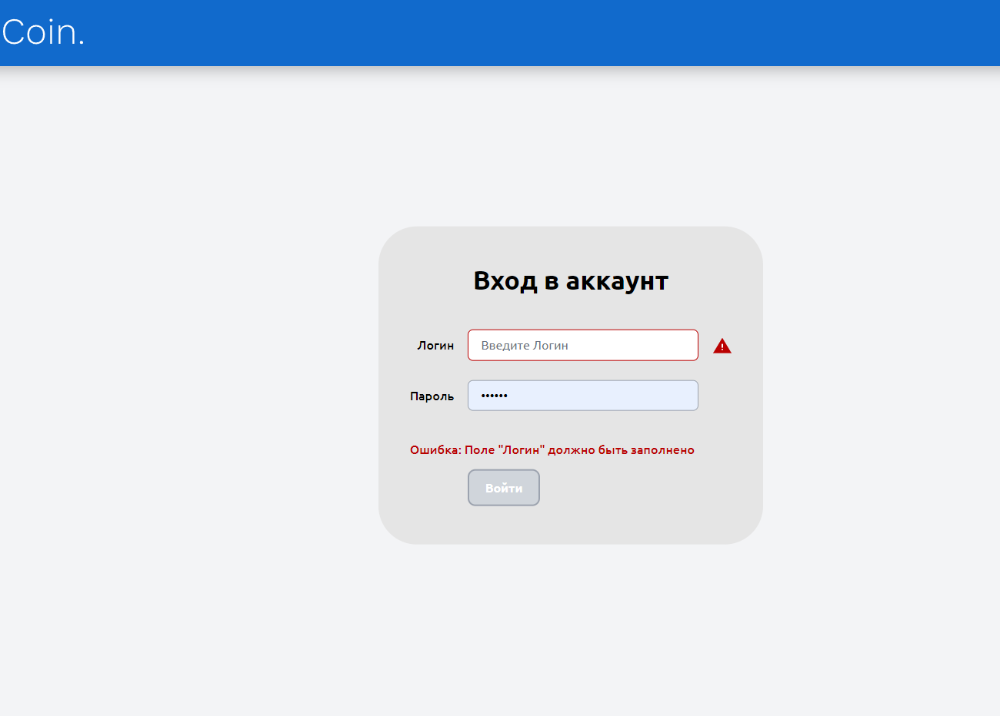

# coin-scss-js-express
Дипломная работа на Javascript Тодор О.В.

Банковская система с авторизацией, работой со счетами криптовалюты транзакциями пользователей.

## Разработка банковской системы хранения и операций над криптовалютными средствами. 

Функционал приложения:

Авторизация 
Управление счетами пользователя: создание нового счёта, отображение списка  счетов, отображение баланса, просмотр истории транзакций 
Переводы на счета или карты других пользователей 
Возможность производить валютные обмены 
Отображение банкоматов на карте 
Форма входа пользователя 
Список счетов пользователя 
Просмотр информации о существующей карте 
Форма для перевода средств 
Подробная история баланса по карте 
Мониторинг курса валют и валютные переводы 
Отображение точек банком-тов.
 

